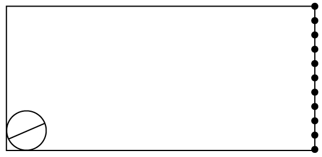

# watanabe-illusion-vlm

Code, stimuli, and raw data for the paper:

> **Vision-Language Models Reproduce a Human Mental-Extrapolation Bias in the Watanabe Illusion**
> (manuscript in preparation; citation will be added upon publication)

This repository contains everything needed to reproduce the human experiment, the behavioral experiments on five vision-language models (VLMs), and the internal analyses of Qwen2.5-VL-32B reported in the paper.

<p align="center">
  
</p>

## The stimulus

The Watanabe Illusion is publicly available on Figshare (Watanabe, 2018; https://doi.org/10.6084/m9.figshare.5838606). Related phenomena were reported by Bouma and Andriessen (1968) and Usui and Kitaoka (2025); the paper is the first quantitative study of this stimulus itself. The stimulus shows a line segment inside a circle in the lower-left corner and a column of 11 dots on the right edge. Geometrically, the extension of the line passes through **dot 1 (the topmost dot)**. Human observers, however, systematically report a dot near the middle of the column. We call this the *mental-extrapolation bias*.

| Property | Value |
|---|---|
| File | `stimuli/104.jpg` |
| Size | 539 × 264 px |
| Line angle | 23.5° |
| Dots on right edge | 11 |
| Correct answer | dot 1 from the top (dot 11 from the bottom) |
| MD5 | `9cba67ee1a9ccb213dcab20206e4135e` |

An online demo of the human task is available on Gorilla: https://app.gorilla.sc/task/16687748

## Main findings

| Source | N | Q1 mean (SD) | Illusion Index II mean (SD) |
|---|---|---|---|
| Human (Gorilla) | 133 | 4.63 (2.62) | 4.15 (2.26) |
| Qwen2.5-VL-32B | 60 | 5.22 (0.90) | 4.91 (0.63) |
| Qwen2.5-VL-7B | 59 | 4.78 (2.51) | 4.96 (1.62) |
| Claude Sonnet 4.6 | 60 | 4.30 (1.53) | 5.17 (1.13) |
| GPT-5.5 Instant | 60 | 8.03 (1.34) | 7.78 (0.75) |
| Gemini 3.5 Flash | 59/60 | 7.10 (1.86) | 6.08 (1.27) |

II = ((Q1 − 1) + (11 − Q2)) / 2. A veridical response gives II = 0; the maximum illusion gives II = 10.

1. **All five VLMs show the human-direction bias.** Only 2 of 299 VLM trials were veridical.
2. **The vision encoder holds the correct information.** Linear probes on Qwen2.5-VL-32B's vision encoder recover the target dot 6 to 8 times more accurately than the model's own behavioral answers.
3. **The bias arises in late language-model layers.** A layer-wise logit lens shows the correct token "1" winning in the middle layers (about 35 to 45 of 64) and being overwritten in later layers only under a visual-judgment framing.
4. **The bias is robust to declarative and semantic interventions.** Naming the illusion, asking the model to ignore prior knowledge, forcing visual chain-of-thought, and 390 semantic preambles (observer identity, environment, neutral context) did not move the response center. Only directly disclosing the correct answer did.
5. **The stimulus is unknown to current VLMs.** Across 80 naming trials, no VLM identified the Watanabe Illusion, while commercial models named classical illusions (Müller-Lyer, Poggendorff, Kanizsa) at up to 100%.

## Repository layout

```
watanabe-illusion-vlm/
├── stimuli/            Stimulus images and ground truth
├── scripts/            Experiment and analysis scripts
├── prompts/            Prompt definitions and protocol documents
├── data/human/         Gorilla exports and cleaned human responses
├── data/manual_logs/   Manual logs of commercial VLM experiments
├── results/            Raw outputs of each experiment
├── Dockerfile.txt      Docker image for the open-weight model runs
└── requirements.txt    Python dependencies for A100 / DGX Spark
```

Derived outputs (statistics JSON, tables, figures) are not committed. They are regenerated by running the analysis scripts on the raw outputs.

## Environment

| Item | Setting |
|---|---|
| Open-weight model host 1 | NVIDIA A100 80GB (x86_64), Docker image `watanabe-illusion:a100` |
| Open-weight model host 2 | NVIDIA DGX Spark (GB10 Grace Blackwell, 128GB unified memory, ARM64, CUDA 13.0), Docker image `watanabe-illusion:phase5` |
| Models | `Qwen/Qwen2.5-VL-32B-Instruct`, `Qwen/Qwen2.5-VL-7B-Instruct` (BF16, native dynamic resolution) |
| Generation (behavior, interventions) | temperature 1.0, top_p 1.0, repetition_penalty 1.05, max_new_tokens 512, fixed per-trial seeds |
| Commercial models (behavior) | Web UI default mode, memory off, a new temporary chat per trial (snapshot of May 2026) |
| Commercial models (recognition probe) | Official APIs, no conversation history |
| Human experiment | Gorilla online experiment platform |
| Statistics | Sample SD (ddof = 1); direction normalization value → 11 − value + 1 |

Open-weight scripts are run inside the Docker container (`docker run --gpus=all ...`). Commercial API scripts require `ANTHROPIC_API_KEY`, `OPENAI_API_KEY`, and `GOOGLE_API_KEY` (or `GEMINI_API_KEY`).

## ⚠️ Hard-coded paths in the scripts

Most scripts do **not** take input and output paths as command-line options. The paths are written as constants near the top of each script (`STIMULUS_PATH`, `OUT_DIR`, `SRC`, `OUT`, and so on), and they reflect the environments in which the scripts were originally run. **Check and, if necessary, edit these constants before running a script.**

### (a) Docker-container paths (`/workspace/...`)

The experiment and probe scripts assume that the repository root is mounted at `/workspace` inside the container:

```bash
docker build -t watanabe-illusion:a100 -f Dockerfile.txt .
docker run --rm -it --gpus=all -v "$(pwd)":/workspace watanabe-illusion:a100
```

With this mount, `/workspace/stimuli/104.jpg` and `/workspace/results/...` resolve to the repository's `stimuli/` and `results/`. Known mismatches:

| Script | Expects | In this repository | What to do |
|---|---|---|---|
| `run_qwen25vl_pie_oneshot_a100.py`, `run_qwen25vl_pie_combined_a100.py` | `/workspace/csv/pie_prompts_v2.csv` | `prompts/pie_prompts_v2.csv` | Change `PROMPTS_CSV` to `/workspace/prompts/pie_prompts_v2.csv` |
| `run_qwen25vl_pie_a100.py` (earlier PIE design, not used for the paper's tables) | `/workspace/pie_prompts_v1.csv` | not included | Not needed to reproduce the paper |
| `Dockerfile.txt` | `COPY requirements.a100.txt` | `requirements.txt` | Change the `COPY` line to `requirements.txt` |
| `check_vit_letterbox_shape.py`, `analyze_qwen25vl_vit_a100.py`, `train_decoder.py`, `run_qwen25vl_recognition_stage2_a100.py` | parametric stimuli in `/workspace/stimuli/` | generated by `scripts/generate_stimuli.py` (run it from the repository root first) | — |

Writing to `/workspace/results/...` **overwrites the committed raw outputs** in `results/`. Point `OUT_DIR` / `OUT_BASE` to a new directory if you want to keep them.

### (b) Paths from the original authoring sandbox (`/mnt/project`, `/mnt/user-data/...`, `/home/claude`)

The figure and some analysis scripts were written in a sandbox where input files were placed flat in `/mnt/project` or `/mnt/user-data/uploads`, and outputs were written to `/mnt/user-data/outputs` or `/home/claude`. **These paths do not exist on your machine; edit them before running.**

| Script | Constants to edit | Input to point to |
|---|---|---|
| `make_fig1.py` | `STATS`, `IMG_A`, `IMG_B`, `OUT` | `stats_extended.json` (output of `analyze_commercial_vlm.py`), `stimuli/104.jpg`, `stimuli/104_jpg_ChatGPT_Image.png` |
| `make_fig2.py` | `ANGLE`, `SPATIAL`, `OUT` | `results/qwen25vl_vit_probe_a100/fig_angle_probe.png`, `fig_spatial_probe.png` |
| `make_fig3.py` | `SRC`, `OUT` | `results/qwen25vl_logit_lens_v{1..4}_a100/` |
| `make_fig4.py` | `STATS`, `OUT` | `cancellation_stats.json` (output of `plot_cancellation_v1.py`) |
| `make_figA1.py` | `SRC`, `OUT` | `stimuli/control_*.png` |
| `plot_cancellation_v1.py` | `INPUT_JSON`, `OUT_DIR` | `results/qwen25vl_cancellation_v1_a100/cancellation_progress.json` |
| `analyze_n60_q1q2.py` | `A100_JSON`, `SPARK_JSON`, `HUMAN_CSV`, `OUT_DIR` | `results/.../n60_progress.json`, `data/human/human_2nd_test.csv` |
| `analyze_qwen25vl_n60_v2.py` | first argument (default `/mnt/user-data/uploads/...`) | pass the path as an argument |
| `plot_qwen25vl_n60_v2_vs_human.py` | `--input`, `--out-dir` (defaults point to the sandbox) | pass the paths as options |

Scripts that already take paths as options and need no editing: `analyze_commercial_vlm.py`, `parse_manual_log.py`, `analyze_recognition_stage2.py`, `run_commercial_recognition_stage2.py`, `plot_logit_lens_4panel.py`.

## Reproducing each experiment

### 1. Stimuli

| File | Description |
|---|---|
| `stimuli/104.jpg` | Main stimulus |
| `scripts/generate_stimuli.py` | Parametric stimuli (17 angles × 4 conditions = 68 images) |
| `stimuli/stimulus_metadata.csv` | Ground truth for the 68 images (angle, intersection, dot counts, circle parameters) |
| `scripts/measure_stimulus_v2.py` | Measures line angle, dot positions, and correct dot directly from the image |
| `stimuli/control_muller_lyer.png`, `control_poggendorff.png`, `control_kanizsa.png` | Classical-illusion positive controls (Figure A1) |
| `stimuli/G1.png`, `G2.png`, `G3.png` | Screens shown in the Gorilla experiment |
| `stimuli/104_jpg_ChatGPT_Image.png` | Output of the image-generation demonstration (Figure 1b) |

```bash
python scripts/generate_stimuli.py
```

### 2. Human experiment (Section 2, Figure 1c–e, Table B1)

| File | Description |
|---|---|
| `data/human/informed_consent_l3tm.xlsx`, `practice_vm9m.xlsx`, `q_spatial_gk97.xlsx`, `q_angle_xrfj.xlsx`, `q_reverse_ul26.xlsx` | Gorilla task definitions (consent, practice, Q1, Q3, Q2) |
| `data/human/ueda_1st_test_q_all_1fin.xlsx`, `ueda_2nd_test_q_all_2fin.xlsx` | Raw Gorilla exports |
| `data/human/human_1st_test.csv`, `human_2nd_test.csv` | Cleaned responses (Q1, Q2, Q3) |
| `data/human/human_2nd_test_Q1Q2.csv` | Q1/Q2 extraction from an earlier cleaning pass (not used for the paper's statistics) |

**The paper uses `human_2nd_test.csv`**, keeping participants who answered both Q1 and Q2 with values in [1, 11]. This yields **N = 133**. The analysis script applies this filter; do not use summary values stored inside the CSV files.

### 3. VLM behavioral experiment (Section 3, Figure 1c–e, Tables B1–B2)

Open-weight models (N = 60 per model):

```bash
# inside Docker on A100
python scripts/run_qwen25vl_n60_a100_q1q2.py --n-trials 3              # pilot
python scripts/run_qwen25vl_n60_a100_q1q2.py --n-trials 60 --resume    # 32B
```

The script in this repository has the model fixed to 32B (`MODEL_ID`) and has no `--model-id` option. For the 7B run, change `MODEL_ID` to `Qwen/Qwen2.5-VL-7B-Instruct` **and** `OUT_DIR` to `/workspace/results/qwen25vl_n60_a100_q1q2_7b`; otherwise the 32B results are overwritten.

`scripts/run_qwen25vl_n60_spark_q1q2.py` is the DGX Spark version. Raw outputs are in `results/qwen25vl_n60_a100_q1q2/` (32B) and `results/qwen25vl_n60_a100_q1q2_7b/` (7B).

Commercial models (Web UI, run by hand, N = 60 per model): follow `prompts/commercial_vlm_protocol.md` and `prompts/prompts.txt`. The full responses are in `data/manual_logs/manual_log_template_n60.md` (canonical data). `data/manual_logs/manual_log_template_N30.md` is from an earlier, preliminary collection and is not used for the paper's statistics. Convert them to JSON:

```bash
python scripts/parse_manual_log.py data/manual_logs/manual_log_template_n60.md \
    --output-dir results/manual
```

Integrated analysis (canonical pipeline; source of Tables B1–B2 and Figure 1c–e):

```bash
python scripts/analyze_commercial_vlm.py \
    --qwen-a100     results/qwen25vl_n60_a100_q1q2/n60_progress.json \
    --qwen-7b       results/qwen25vl_n60_a100_q1q2_7b/n60_progress.json \
    --sonnet46      results/manual/n60_progress_sonnet46.json \
    --gpt55         results/manual/n60_progress_gpt55.json \
    --gemini35flash results/manual/n60_progress_gemini35flash.json \
    --human         data/human/human_2nd_test.csv \
    --out-dir       figures/
```

This writes `stats_extended.json`, `table2_extended.md`, and the figure material. Auxiliary scripts: `plot_vlm_vs_human.py`, `plot_qwen25vl_n60_v2_vs_human.py`, `analyze_n60_q1q2.py`, `analyze_bias.py`, `analyze_qwen25vl_n60_v2.py`.

### 4. Vision encoder probes (Section 4, Figure 2, Table B3)

```bash
# inside Docker on A100
python scripts/analyze_qwen25vl_vit_a100.py --inspect      # locate the vision tower
python scripts/analyze_qwen25vl_vit_a100.py --smoke-test   # 5 images only
python scripts/analyze_qwen25vl_vit_a100.py                # full run
```

Ridge linear probes (leave-one-out) on ViT and Patch Merger outputs, using the 68 parametric stimuli. Results: `results/qwen25vl_vit_probe_a100/probe_results.csv` and `probe_results.json`. The representation cache `representations.npz` (about 567 MB) is not committed; it is regenerated by the script. Related: `check_vit_letterbox_shape.py`, `analyze_vision_encoders.py`, `decoder_model.py`, `train_decoder.py`.

### 5. Logit lens (Section 5, Figure 3, Table B4)

Four fixed continuations are appended to the assistant turn, and the softmax over digit tokens 1–9 is read at the final token position in each of the 64 layers (N = 10 per continuation).

| Script | Continuation |
|---|---|
| `run_qwen25vl_logit_lens_a100.py` (v1) | "The line would hit the " |
| `run_qwen25vl_logit_lens_v2_a100.py` | "The topmost dot is the " |
| `run_qwen25vl_logit_lens_v3_a100.py` | "The number five is the " (control) |
| `run_qwen25vl_logit_lens_v4_a100.py` | "The line would hit dot number " |

```bash
python scripts/run_qwen25vl_logit_lens_a100.py --n-trials 10
python scripts/plot_logit_lens_4panel.py
```

Outputs: `results/qwen25vl_logit_lens_v{1..4}_a100/layer_logits.npz` and `layer_logits_meta.json`.

### 6. Prompt cancellation (Section 6, Figure 4, Table B5)

```bash
python scripts/run_qwen25vl_cancellation_a100_q1.py --n-trials 20
python scripts/plot_cancellation_v1.py
```

8 conditions × N = 20 (160 trials). Raw outputs: `results/qwen25vl_cancellation_v1_a100/cancellation_progress.json`. `plot_cancellation_v1.py` computes the per-condition statistics from this file and writes `cancellation_stats.json` (source of Table B5 and Figure 4; not committed). Edit the paths in `plot_cancellation_v1.py` first (see *Hard-coded paths*). Full prompt texts are given in Appendix C.2 of the paper.

### 7. Semantic preamble intervention, PIE (Section 6, Table B6)

`prompts/pie_prompts_v2.csv` contains 390 preambles (3 categories × 130: Character, Environment, Neutral). Each condition runs 130 one-shot trials, each with a different preamble and seed, with no repetition. The per-condition N was set to match the human sample size at design time (N ≈ 130); the final human N is 133.

```bash
python scripts/run_qwen25vl_pie_oneshot_a100.py              # conditions A–G, about 3 h on A100
python scripts/run_qwen25vl_pie_oneshot_a100.py --pilot      # 5 trials per condition
python scripts/run_qwen25vl_pie_oneshot_a100.py --condition A
python scripts/run_qwen25vl_pie_combined_a100.py             # conditions H–I
```

Outputs: `results/pie_oneshot_20260527_005108/` and `results/pie_combined_20260527_043814/` (`config.json`, `responses.jsonl`, `condition_summary.csv`). Condition definitions, seed scheme, and message structure are in Appendix C.3. `prompts/pie_prompts_v1.md` is the design document of the first version (300 preambles; all 300 are retained unchanged in v2).

### 8. Recognition probe (Appendix A, Table A1)

4 stimuli (104.jpg and 3 classical controls) × 3 questions (familiarity yes/no, forced naming, description + recognition) × N = 10, with web search prohibited. Models: Qwen2.5-VL-32B (A100) and Claude Opus 4.7, GPT-5.5, Gemini 3.5 Flash via API. The commercial models were run through the APIs because the authors' Web UI accounts contained prior conversations about this illusion.

```bash
# Qwen (inside Docker on A100)
python scripts/run_qwen25vl_recognition_stage2_a100.py

# Commercial models (360 API calls)
pip install anthropic openai google-genai
python scripts/run_commercial_recognition_stage2.py --pilot
python scripts/run_commercial_recognition_stage2.py --n-trials 10 --resume

# Aggregation
python scripts/analyze_recognition_stage2.py \
    --qwen       results/qwen25vl_recognition_stage2_a100/summary.csv \
    --commercial results/commercial_recognition_stage2/summary.csv \
    --out-dir    figures/
```

Note on misidentification counts: the script counts trials and illusion names separately. A single response can name more than one illusion, so the name counts (14) can exceed the number of misidentified trials (13).

## Figures

| Figure | Script | Input |
|---|---|---|
| `fig1.png` | `scripts/make_fig1.py` | `stimuli/104.jpg`, `stimuli/104_jpg_ChatGPT_Image.png`, `stats_extended.json` |
| `fig2.png` | `scripts/make_fig2.py` | Probe figures from `analyze_qwen25vl_vit_a100.py` |
| `fig3.png` | `scripts/make_fig3.py` | `results/qwen25vl_logit_lens_v{1..4}_a100/` |
| `fig4.png` | `scripts/make_fig4.py` | `cancellation_stats.json` (output of `plot_cancellation_v1.py`) |
| `figA1.png` | `scripts/make_figA1.py` | Classical control stimuli |

Edit the input and output paths at the top of each `make_fig*.py` before running (see *Hard-coded paths*). All figures use a shared color scheme: crimson (`#dc143c`) for the geometric ground truth and light cyan (`#e5ffff`) for reference ranges.

## Limitations of the data

- Behavioral comparisons rely on a single stimulus (104.jpg, 23.5°); angle dependence of the bias has not been tested behaviorally.
- Commercial-model numbers are a snapshot of Web UI default behavior in May 2026 and may change as the services are updated.
- Human variance reflects between-participant differences, whereas VLM variance reflects stochastic decoding within a single model.

## Citation

Citation information will be added upon publication.

```bibtex
@article{watanabe_illusion_vlm,
  title   = {Vision-Language Models Reproduce a Human Mental-Extrapolation Bias in the Watanabe Illusion},
  author  = {Watanabe, Eiji and Ueda, Kyohei and Kato, Kagayaki and Watabe, Masaki and Kitaoka, Akiyoshi},
  journal = {TBD},
  year    = {TBD}
}
```

## License

MIT for code and CC BY 4.0 for stimuli and data

## Contact

Eiji Watanabe, National Institute for Basic Biology (NIBB), Okazaki, Japan
